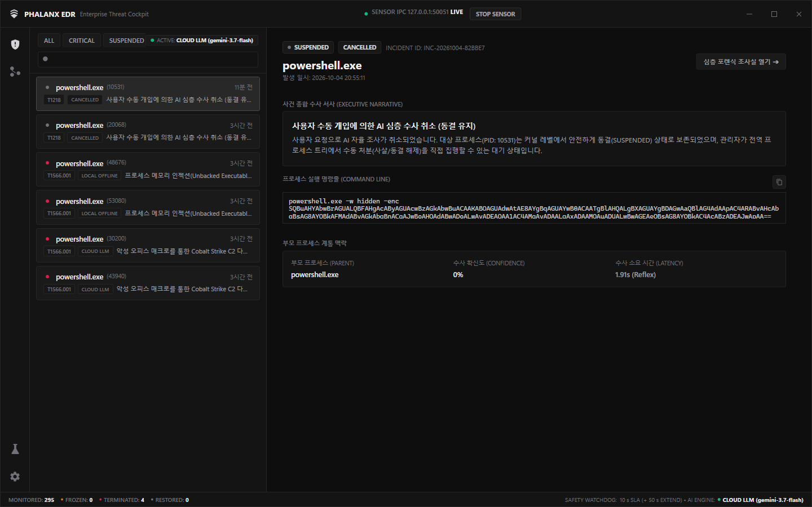
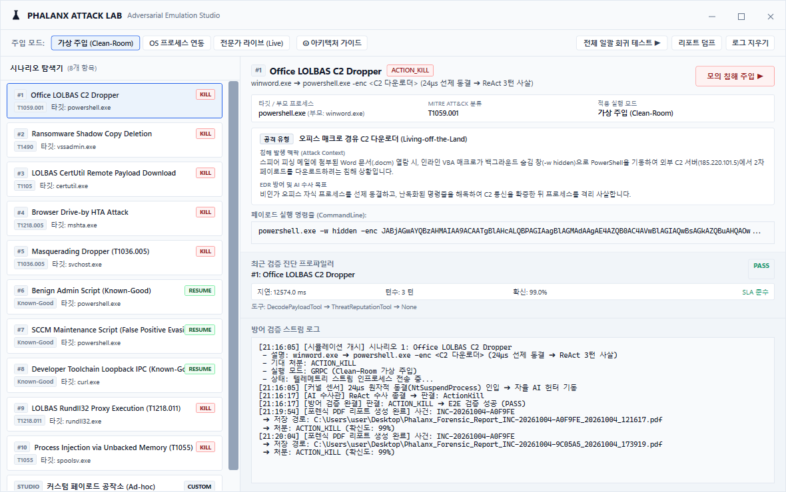
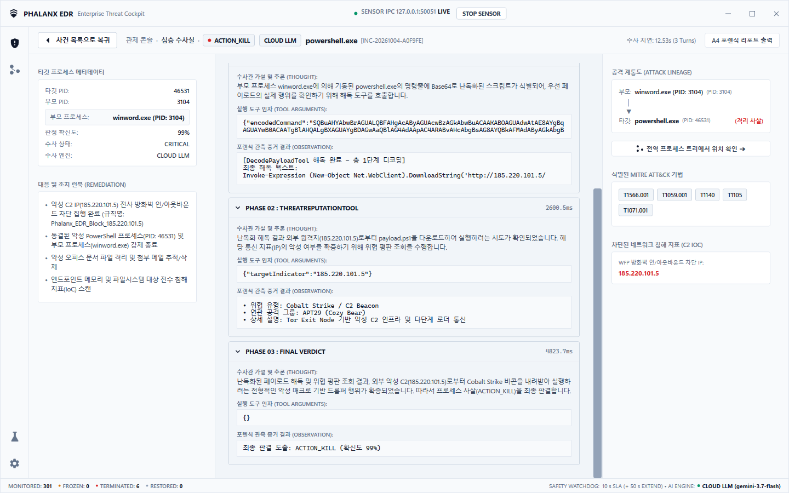
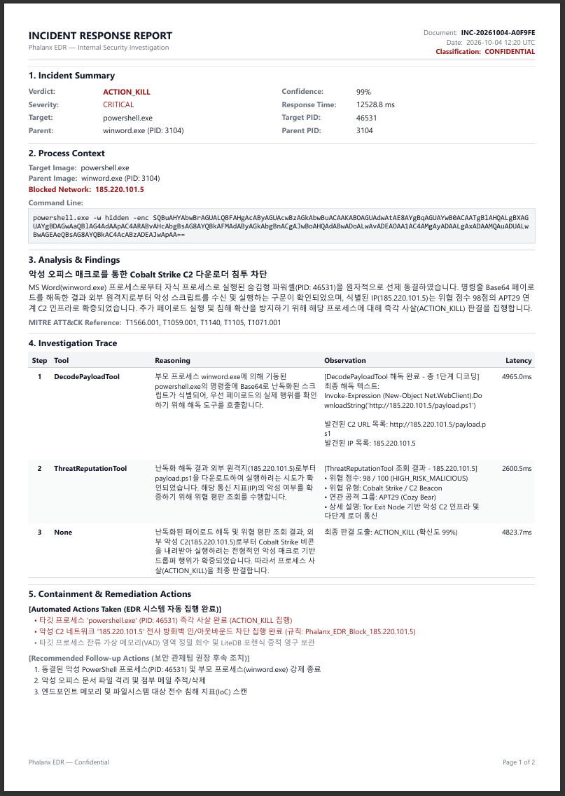
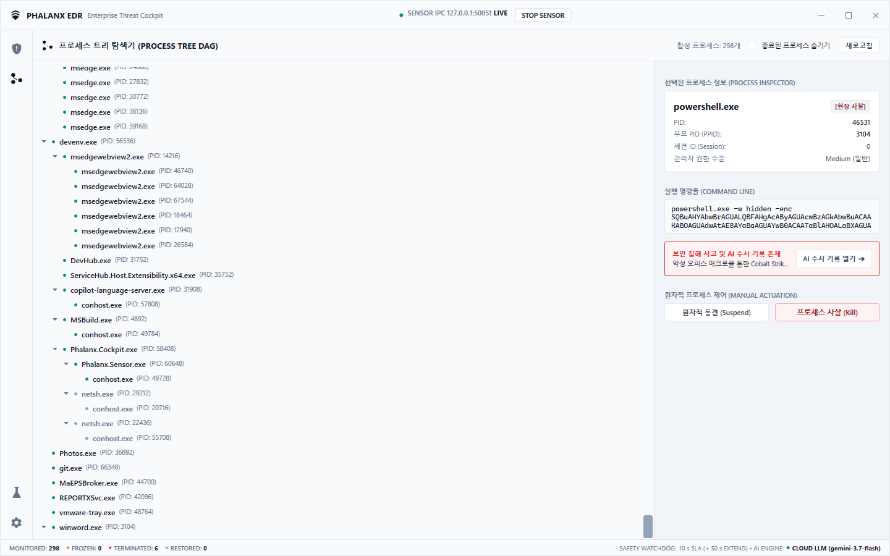
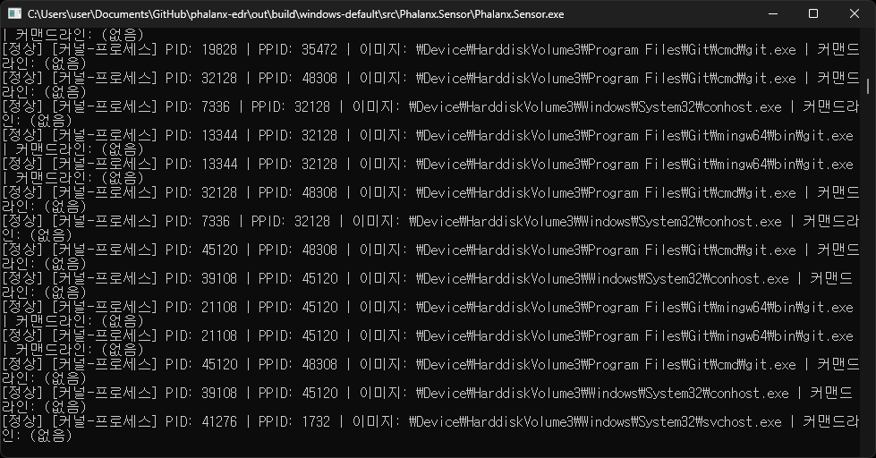

# Phalanx: AI-Augmented Endpoint Detection & Response (EDR)

Phalanx는 Windows ETW(Event Tracing for Windows) 커널 텔레메트리 기반의 초저지연 프로세스 격리와 Gemini ReAct 에이전트의 자율 포렌식 조사를 결합한 엔드포인트 탐지 및 대응(EDR) 시스템입니다.  
악성 의심 프로세스 감지 즉시 커널 레벨에서 선제적으로 실행을 동결(`NtSuspendProcess`)하고, AI 에이전트가 OS 포렌식 도구를 자율 실행하여 침해 원인 규명 및 대응 리포트를 생성합니다.

* **시연 영상**: [Phalanx-EDR](https://www.youtube.com/watch?v=SD_Ro2brbOk)

---

## Architecture Highlights

* **Kernel Preemption**: C++20 기반 ETW 이벤트 수집 및 `NtSuspendProcess`를 통한 악성 프로세스 선제 동결
* **Autonomous Investigation**: ReAct(Reasoning + Acting) 루프 기반 공격 체인 분석 및 7종 네이티브 OS 포렌식 도구 자율 호출
* **Zero-Loss Streaming**: 락-스왑(Lock-Swap) 큐 기반의 무손실 텔레메트리 수집 및 gRPC 양방향 프로세스 제어 IPC
* **Hybrid Reasoning Pipeline**: 실시간 클라우드 LLM(Gemini) 추론 및 오프라인 로컬 Fallback 룰 엔진 지원

---

## Visual Showcase

| 엔터프라이즈 관제 대시보드 | 모의 침해 시뮬레이터 (Attack Lab) |
| :---: | :---: |
|  |  |
| *프로세스 상태 감시, 선제 격리 현황 및 이벤트 타임라인* | *LOLBins, C2 통신 등 실전 공격 시나리오 인젝션* |

| ReAct 자율 수사 로그 | 종합 포렌식 리포트 |
| :---: | :---: |
|  |  |
| *Thought → Action → Observation 자율 추론 파이프라인* | *MITRE ATT&CK 기법 매핑 및 IoC 디지털 증거 요약* |

| 프로세스 트리 (DAG) | C++20 네이티브 커널 센서 |
| :---: | :---: |
|  |  |
| *부모-자식 계통도 추적 및 비인가 프로세스 탐지* | *ETW 이벤트 스트리밍 및 커널 서스펜드 엔진* |

---

## Documentation

상세 아키텍처 및 세부 설계 문서는 공식 지식베이스를 참조합니다.

* [00_project_overview.md](https://github.com/jin20203458/Obsidian.Agent/blob/main/Phalanx/docs/00_project_overview.md) — 프로젝트 비전, 시스템 불변식 및 설계 목표
* [01_system_architecture.md](https://github.com/jin20203458/Obsidian.Agent/blob/main/Phalanx/docs/01_system_architecture.md) — C++20 센서 구조, 락-스왑 동시성 모델, gRPC IPC 스키마, 관제 콘솔
* [02_ai_agent_investigation_design.md](https://github.com/jin20203458/Obsidian.Agent/blob/main/Phalanx/docs/02_ai_agent_investigation_design.md) — ReAct 추론 루프, 7종 OS 포렌식 도구 명세, LiteDB 영속성 파이프라인
* [03_implementation_roadmap.md](https://github.com/jin20203458/Obsidian.Agent/blob/main/Phalanx/docs/03_implementation_roadmap.md) — 단계별 기능 구현 마일스톤 및 아키텍처 불변식
* [04_performance_benchmarks.md](https://github.com/jin20203458/Obsidian.Agent/blob/main/Phalanx/docs/04_performance_benchmarks.md) — 프로세스 격리 지연시간, 메모리 누수 검증, 실무 스트레스 벤치마크 실측치

---

## Prerequisites

* **OS**: Windows 10 / 11 (x64)
* **Privileges**: Administrator 권한 필수 (ETW 커널 세션 생성 및 `NtSuspendProcess` 호출)
* **.NET SDK**: [.NET 9.0 SDK 이상](https://dotnet.microsoft.com/download/dotnet) (타깃 프레임워크: `net9.0-windows`)
* **C++ Build Tools** *(센서 빌드 시 필요)*:
  * Visual Studio 2022 (MSVC v143, Desktop development with C++)
  * CMake 3.24+ 및 Ninja
  * vcpkg (Manifest Mode)

---

## Build & Test

모든 명령은 관리자 권한 PowerShell 콘솔에서 수행합니다.

### Build
```powershell
# C# 솔루션 빌드
dotnet build Phalanx.sln -c Release

# C++ 네이티브 센서 빌드
powershell -ExecutionPolicy Bypass -File .\build.ps1
```

### Test & QA
```powershell
# 단위 테스트 (로컬 고속 QA)
dotnet test tests/Phalanx.Agent.Tests/ --filter "Category=Unit"

# 스트레스 벤치마크 (10대 실무 시나리오)
dotnet test tests/Phalanx.Agent.Tests/ --filter "Category=NeutralBenchmark"

# 풀체인 E2E 통합 테스트 (센서 -> gRPC -> Agent)
powershell -ExecutionPolicy Bypass -File .\scripts\run_fullchain_test.ps1

# 클라우드 라이브 LLM 수사 벤치마크 (~3.5분 소요)
dotnet test tests/Phalanx.Agent.Tests/ --filter "Category=Live" --logger "console;verbosity=normal"
```

> **Note**: 필터 없이 `dotnet test` 실행 시 `Category=Live`(실제 클라우드 API 호출)가 포함되어 실행 시간이 길어집니다. 일반 로컬 테스트 시에는 `Category=Unit` 필터 사용을 권장합니다.

---

## Quick Start

### 1. 관제 콘솔(Cockpit) 실행
```powershell
dotnet run --project src/Phalanx.Cockpit/Phalanx.Cockpit.csproj -c Release
```

### 2. 모의 침해 시뮬레이터 실행
* **GUI**: 관제 콘솔 좌측 **[어택랩]** 메뉴에서 공격 시나리오 선택 후 주입 실행
* **CLI**:
  ```powershell
  powershell -ExecutionPolicy Bypass -File .\scripts\run_attack_simulator.ps1
  ```

### 3. C++ 센서 단독 실행
```powershell
.\out\build\windows-default\src\Phalanx.Sensor\Phalanx.Sensor.exe
```

---

## Configuration

Phalanx는 외부 API 연동 없는 오프라인 모드를 기본으로 지원하며, 필요 시 클라우드 LLM 추론 모드로 전환할 수 있습니다.

### 모드별 동작 구성

| 모드 | 네트워크 요구사항 | 추론 엔진 | 설정 방법 |
| :--- | :--- | :--- | :--- |
| **Offline Mode (Default)** | 완전 격리 (오프라인) | 로컬 Fallback ReAct 엔진 | 별도 설정 불필요 (`LOCAL FALLBACK`) |
| **Cloud LLM Mode** | 아웃바운드 인터넷 | Google Gemini 3.7 Flash | API 키 등록 (`CLOUD LLM`) |

### Gemini 클라우드 API 설정

`AppSettings.json` 파일에 Google AI Studio API 키를 설정하거나 Cockpit GUI의 [설정] 메뉴에서 등록합니다.

```json
{
  "Gemini": {
    "ApiKey": "YOUR_GEMINI_API_KEY",
    "ModelName": "gemini-3.7-flash",
    "UseVertexAI": false
  }
}
```

*Vertex AI 연동 시 `UseVertexAI: true`로 설정하고 `Config/google-credentials.json` 서비스 계정 키를 구성합니다.*
